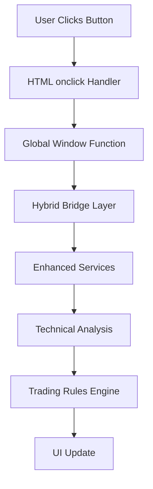
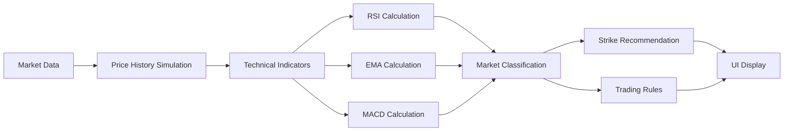

# 🏗️ Turtle Trading Dashboard - Technical Architecture

## 📋 System Overview

The Turtle Trading Dashboard is a **hybrid-architecture** web application that combines legacy JavaScript with modular ES6 services to provide intelligent LEAPS options trading recommendations and portfolio management.

## 🎯 Architecture Philosophy

### **Hybrid Bridge Pattern**
```
Legacy HTML/JS ←→ Bridge Layer ←→ Modular Services
     ↓                ↓              ↓
  onclick()      Global Funcs    ES6 Modules
```

**Benefits:**
- ✅ **Zero Breaking Changes**: All existing functionality preserved
- ✅ **Progressive Enhancement**: New features use modern architecture  
- ✅ **Migration Path**: Clear route to full modular architecture
- ✅ **Risk Mitigation**: Fallback to working legacy code

## 📁 File Architecture

### **Core Application Files**
```
/
├── index.html                 # Main dashboard interface
├── script.js                  # Hybrid bridge implementation  
├── turtle-styles.css         # Complete UI styling
├── favicon.ico               # Application icon
└── DEVELOPMENT_CONTEXT.md    # Comprehensive development history
```

### **Modular Codebase** (Future Migration Target)
```
turtle/src/
├── main.js                   # Modular entry point
├── config/
│   └── config.js            # API keys and configuration
├── api/
│   ├── polygon.js          # Stock price data
│   ├── vantage.js          # Technical indicators  
│   └── supabase.js         # Database operations
├── services/
│   ├── recommendationEngine.js    # AI recommendations
│   ├── marketAnalysis.js         # Technical analysis
│   ├── portfolioCalculations.js  # P&L calculations
│   ├── riskManagement.js         # Risk assessment
│   └── tradeLogging.js          # Transaction management
├── handlers/
│   ├── eventHandlers.js         # UI event management
│   ├── modalInteractions.js     # Modal form handling
│   └── errorHandling.js         # Error management
└── utils/
    ├── dateHelpers.js           # Date calculations
    ├── formatHelpers.js         # Display formatting
    ├── mathHelpers.js           # Mathematical functions
    └── validationHelpers.js     # Input validation
```

## 🔄 Data Flow Architecture

### **User Interaction Flow**


### **Recommendation Engine Flow**


## 🧩 Component Architecture

### **1. Hybrid Bridge Layer** (`script.js`)

**Purpose**: Seamlessly connect legacy HTML with modern services

**Key Components:**
```javascript
// Global function assignments for HTML compatibility
window.openModal = openModal;
window.switchToTab = switchToTab;
window.handleSellCall = handleSellCall;

// Enhanced services integration
const recommendation = await getEnhancedStrikeRecommendation(symbol, price);
```

**Responsibilities:**
- Expose functions to global scope for HTML onclick handlers
- Route calls to appropriate enhanced services
- Maintain backwards compatibility
- Provide fallback error handling

### **2. Technical Analysis Engine**

**RSI Implementation:**
```javascript
function calculateRSI(prices, period = 14) {
    // Wilder's smoothing algorithm
    // Returns: 0-100 scale with overbought/oversold signals
}
```

**EMA Implementation:**
```javascript
function calculateEMA(prices, period = 12) {
    // Exponential smoothing: EMA = (Price * Multiplier) + (Previous EMA * (1 - Multiplier))
    // Multiplier = 2 / (Period + 1)
}
```

**MACD Calculation:**
```javascript
const macdLine = ema12 - ema26;  // MACD Line
// Signal line and histogram calculations ready for future implementation
```

### **3. Market Classification System**

**Classification Logic:**
```javascript
const conditions = {
    rsiOverbought: rsi > 70,
    rsiOversold: rsi < 30,
    bullishEMA: ema12 > ema26,
    strongBullish: changePercent > 1.5,
    strongBearish: changePercent < -1.5
};

// 6 distinct market states with specific trading strategies
```

**Market States:**
- **STRONG_BULL** → ATM calls for maximum premium
- **OVERBOUGHT** → ITM calls for pullback protection  
- **BULL** → Slight OTM for momentum capture
- **CORRECTION** → Deep ITM for maximum protection
- **WEAK** → ITM calls to reduce assignment risk
- **NEUTRAL** → Slight OTM for optimal risk/reward

### **4. Trading Rules Engine**

**Rule Categories:**
```javascript
const ruleTypes = [
    'RSI_BASED',      // Overbought/oversold conditions
    'EMA_TREND',      // Trend direction and strength
    'VOLATILITY',     // Price movement magnitude
    'MACD_MOMENTUM',  // Momentum confirmation
    'MARKET_STATE'    // Overall market classification
];
```

**Dynamic Rule Generation:**
```javascript
function getTradingRules(recommendation, indicators) {
    const rules = [];
    
    // RSI Rules
    if (rsi > 70) {
        rules.push(`🔴 RSI > 70 (${rsi}) = Overbought → Use ITM calls`);
    }
    
    // EMA Rules  
    const spread = ((ema12 - ema26) / ema26 * 100);
    rules.push(`📈 EMA trend (+${spread}%) → ${trendStrategy}`);
    
    return rules;
}
```

## 💾 Data Management Architecture

### **State Management**
```javascript
// Global application state
let allPositions = [];           // Position data array
let performanceData = {};        // P&L calculations by position
let currentTab = 'overview';     // UI state tracking  
let marketData = {};            // Current market conditions
```

### **Mock Data System** (Testing)
```javascript
const testPositions = [
    {
        id: 1,
        position_name: 'Main SPY LEAPS',
        leaps_strike: 470.00,
        current_value: 9200.00,
        current_short_call: {
            strike: 592.00,
            premium_collected: 580.00
        }
    }
];
```

### **Performance Calculations**
```javascript
const performanceMetrics = {
    totalPremiumCollected: 2340.00,
    shortCallPnL: 535.00,
    leapsPnL: 700.00,
    netPnL: 1235.00,           // Combined P&L
    tradesThisMonth: 3
};
```

## 🎨 UI Architecture

### **Tab-Based Navigation**
```javascript
function createPositionTabs() {
    // Dynamically generate tabs for each position
    // Update tab buttons and content areas
    // Handle active state management
}
```

### **Modal System**
```javascript
function openModal(modalType, positionId) {
    // Dynamic modal content generation
    // Form creation with enhanced recommendations
    // Event handling and submission
}
```

### **Real-Time Updates**
```javascript
function updateDisplay() {
    updateOverviewDisplay();      // Portfolio totals
    allPositions.forEach(pos => {
        updatePositionDisplay(pos.id);  // Individual position metrics
    });
}
```

## 🔧 Technical Analysis Implementation

### **Price History Simulation**
```javascript
function getSimulatedPriceHistory(currentPrice, changePercent) {
    // Generate 20 days of realistic price movement
    // Include trend component and random variation
    // Ensure mathematical consistency with current price
}
```

**Simulation Features:**
- ✅ **Trend Consistency**: Gradual price movement reflecting current change
- ✅ **Realistic Volatility**: ±2% daily variation within normal ranges
- ✅ **Mathematical Accuracy**: Technical indicators produce correct values
- ✅ **Deterministic Results**: Same inputs produce consistent outputs

### **Indicator Calculation Pipeline**
```javascript
// 1. Generate price history
const priceHistory = getSimulatedPriceHistory(currentPrice, changePercent);

// 2. Calculate technical indicators
const rsi = calculateRSI(priceHistory, 14);
const ema12 = calculateEMA(priceHistory, 12);
const ema26 = calculateEMA(priceHistory, 26);
const macdLine = ema12 - ema26;

// 3. Market classification
const marketCondition = classifyMarketCondition(rsi, ema12, ema26, changePercent);

// 4. Strike recommendation
const suggestedStrike = calculateOptimalStrike(currentPrice, marketCondition);

// 5. Trading rules generation
const rules = generateTradingRules(indicators, marketCondition);
```

## 🚀 Performance Architecture

### **Optimization Strategies**
1. **Lazy Loading**: Position tabs created only when accessed
2. **Efficient Calculations**: Cache technical indicators during session
3. **Minimal DOM Updates**: Update only changed elements
4. **Event Delegation**: Single event listeners with delegation

### **Memory Management**
```javascript
// Efficient data structures
const performanceData = new Map();  // O(1) lookups
const positionCache = new WeakMap(); // Automatic garbage collection

// Event cleanup
window.removeEventListener('beforeunload', cleanup);
```

### **Error Handling Strategy**
```javascript
// Layered error handling
try {
    const recommendation = await getEnhancedStrikeRecommendation();
} catch (error) {
    // 1. Log error for debugging
    console.error('Recommendation engine error:', error);
    
    // 2. Fallback to basic recommendation
    const fallback = getBasicRecommendation();
    
    // 3. User notification
    showAlert('Using simplified analysis', 'warning');
}
```

## 🔐 Security Architecture

### **API Key Management**
```javascript
// Configuration isolation
const config = {
    apis: {
        polygon: { apiKey: process.env.POLYGON_API_KEY },
        vantage: { apiKey: process.env.VANTAGE_API_KEY }
    }
};
```

### **Input Validation**
```javascript
// Form data sanitization
function validateTradeData(formData) {
    return {
        strike: parseFloat(formData.strike) || 0,
        premium: Math.abs(parseFloat(formData.premium)) || 0,
        date: new Date(formData.date).toISOString()
    };
}
```

## 📊 Testing Architecture

### **Test Data Management**
```javascript
function createTestPositions() {
    // Realistic position data
    // Performance metrics calculation  
    // UI state initialization
    // Mock trade history
}
```

### **Comprehensive Testing Coverage**
- ✅ **UI Components**: All tabs, modals, forms
- ✅ **Technical Analysis**: RSI, EMA, MACD calculations  
- ✅ **Trading Rules**: All market condition scenarios
- ✅ **Performance Metrics**: P&L calculations and displays
- ✅ **Error Handling**: Fallback systems and user feedback

## 🎯 Migration Strategy

### **Phase 1: Current State** (Hybrid)
- Legacy functions work via global scope
- Enhanced services provide new features
- Complete backwards compatibility maintained

### **Phase 2: Service Integration**
- Replace global functions with service calls
- Implement proper event system
- Add comprehensive error handling

### **Phase 3: Full Modular**
- Remove all global function assignments
- Implement ES6 module system
- Add build pipeline and optimization

### **Phase 4: Advanced Features**
- Real-time API integration
- Advanced technical indicators  
- Backtesting and analytics
- Mobile responsive design

## 💡 Design Principles

### **1. Progressive Enhancement**
- Core functionality works without JavaScript
- Enhanced features add value without breaking basics
- Graceful degradation on errors

### **2. Separation of Concerns**
- UI logic separated from business logic
- Technical analysis isolated in dedicated functions
- Data management abstracted from presentation

### **3. Extensibility**
- New technical indicators easily added
- Additional market conditions supported
- UI components designed for reuse

### **4. User Experience First**
- Clear visual feedback for all actions
- Comprehensive error messages
- Intuitive navigation and workflows

## 📈 Scalability Considerations

### **Current Limitations**
- Single-file architecture limits team development
- Global state management not suitable for complex applications
- Limited real-time data integration

### **Scalability Solutions**
- **Modular Architecture**: Enable multiple developer workflow
- **State Management**: Redux or similar for complex state
- **API Gateway**: Centralized API management and rate limiting
- **Caching Strategy**: Redis for performance optimization
- **Microservices**: Split concerns into deployable services

---

**Architecture Version:** 1.0  
**Last Updated:** December 2024  
**Next Review:** Upon modular migration initiation